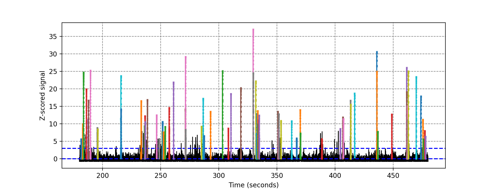
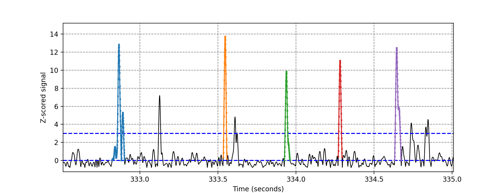

# SharpWaveRipple

How to cite:

[](https://zenodo.org/badge/latestdoi/459619241)


# Overview
The provided script is used to detect sharp wave-ripple (SWR) events from in vivo electrophysiological recordings. The script enables detection of SWR time of initiation and culmination, total event number, peak amplitude, and integral. The script requires a single MATLAB file for each recording channel. Local field potential (LFP) recordings must be prefiltered depending on desired SWR frequency (i.e., 140-250 Hz). 

The structure of the script is the following:
 - inputparameters.py: contains all parameters necessary to run the analyses. It should be edited by the user.
 - SWRdetect.py: contains the main routine performing all data processing, event detection, and data output. It does not need modification.
 - inputData: a folder containing all MATLAB files (extension .mat) that will be processed. A different folder path can be specified in 'inputparameters.py'.
 
Users must supply the appropriate parameters of their recordings and desired experimental design to ensure successful SWR detection. Parameters include sampling frequency of the LFP recording (frequency), the desired SWR minimum duration (window_of_activity), the desired z-score cutoff for a detected event (threshold), and an optional z-score outlier threshold (outlier_threshold). The script enables users to select specific timepoints of their recordings to focus their analyses (begin_time; end_time). 

Upon completion, detected events are saved to two excel sheets titled 'SWRsummary.xlsx' and 'DetailedSWRsummary.xlsx'. 'SWRsummary.xlsx' contains averaged values for each recording (SWR number, duration, etc). 'DetailedSWRsummary.xlsx' provides information regarding each detected SWR event.

# System requirements

The SharpWaveRipple script requires a standard computer with enough RAM to support the operations defined by a user and enough hard-drive space to store the input datasets.

## OS Requirements
SharpWaveRipple is supported for Linux, macOS, and Windows. It was tested on the following systems:
- macOS: Monterey Version 12.0
- macOS: Catalina Version 10.15.5

## Python dependencies
SharpWaveRipple was written and tested with Python 3.9.7. It requires the following packages: 
```
- Numpy 1.22.4
- Scipy 1.7.1
- Pandas 1.3.4
- Matplotlib 3.4.3
```
# Installation guide
SharpWaveRipple does not need installation on the user's machine. It only requires Python and the above specified packages. See below the details of how to run the analyses using the demo data or your own data.

# Demo 

Sample data can be found in the folder InputData. The folder contains four MATLAB files containing recordings from mouse hippocampus. 
To analyze sample data, the user must first download the entire package. Next, the user must open and run the main script SWRdetect.py in any python interface, such as Spyder, or call the application in the command lines as
```
python3 SWRdetect.py
```
This example should run in a few seconds on most machines. There will be two output files:
- DetailedSWRsummary.xlsx: contains a description of all events detected in each recording 
- SWRsummary.xlsx: contains a summary (averages) over all events for each recording

# Instructions for use

To run the script using your own data, replace the sample data in the InputData folder with your own MATLAB files. Alternatively, the user can create a new folder and update the path within the script. All parameters needed for your analyses, including where your files are located, should be edited in the file inputparameters.py. Note: users must change the respective column number when using their own recording files (see table below). The main parameters are the following:

| Variable | Description |
| --- | ----------- |
| begin_time| [in sec] where to start analyzing time series |
| end_time | [in sec] where to stop analyzing time series |
| frequency | [in Hz] frequency of data acquisition (points per second) |
| window_of_activity| [in mili seconds] duration of window of consecutive values above threshold|
| threshold | [-] cutoff value above which windows of activity will be isolated |
| ncol_time | column where the timestamp is located in the matlab file (notice that column number starts at zero in Python)|
| ncol_sinal | column where filtered signal is located in the matlab file (notice that column number starts at zero in Python)|
 
Additional options are available and described in inputparameters.py. To help select the best parameters for your dataset, the option plot_groups can be used. Enabling this feature will open a window showing SWR detection across the user's selected time series. The graphs below demonstrate how detected events are displayed when plot_groups is enabled. Note that each MATLAB file will open its own window, and that windows will have to be closed manually. While optimizing parameters, it may be best to use a small selection of recordings.





